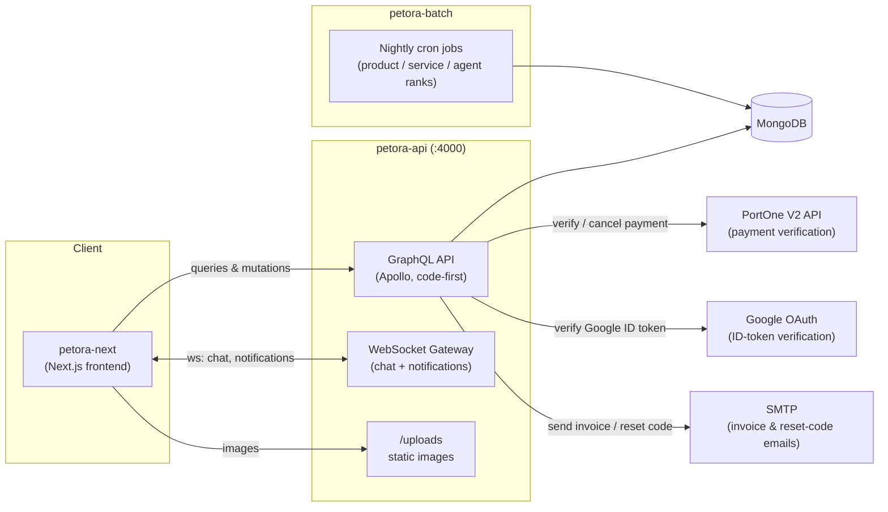
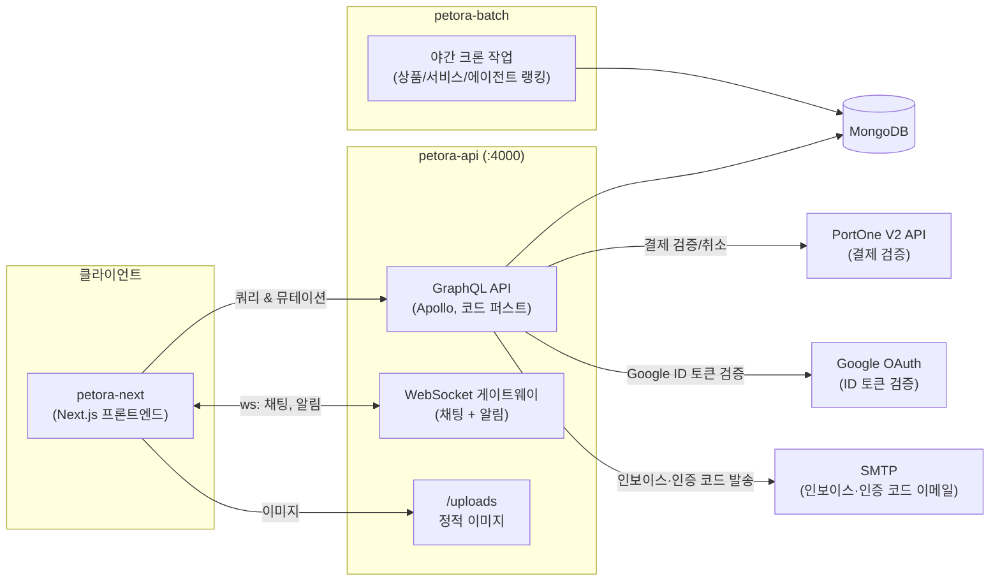

<div align="center">

# 🐾 Petora — Backend Server

**A full-featured pet commerce & pet-care platform API built with NestJS**

[](https://nestjs.com)
[](https://www.typescriptlang.org)
[](https://graphql.org)
[](https://www.mongodb.com)
[](https://github.com/websockets/ws)

**[🇺🇸 English](#english)** · **[🇰🇷 한국어](#korean)**

</div>

---

<a id="english"></a>

# 🇺🇸 English

## 1. What is Petora?

**Petora** is an online platform where pet owners can do everything in one place:

- 🛒 **Shop** — buy pet products (food, toys, clothes, health, accessories) and pay online
- 🐕 **Book services** — reserve pet-care services (day care, walking, grooming, boarding, training, veterinary) offered by verified **agents** across Korean cities
- 🏠 **Discover pets** — browse pets available for adoption
- 💬 **Community** — write articles, comment, like, ask questions (Q&A), and chat in real time
- 🔔 **Stay informed** — receive real-time notifications and bilingual (KR/EN) invoice emails

This repository is the **backend**: a NestJS monorepo that serves a GraphQL API, a WebSocket server, and a separate nightly batch server. The frontend (Next.js) lives in its own repository, **[petora-next](https://github.com/NBekhruzbek/petora-next)**.

## 2. Tech Stack

| Layer             | Technology                                                                        | Purpose                                                        |
| ----------------- | --------------------------------------------------------------------------------- | -------------------------------------------------------------- |
| Framework         | **NestJS 10** (monorepo mode)                                                     | Modular server architecture, dependency injection              |
| Language          | **TypeScript 5**                                                                  | Type safety across the entire codebase                         |
| API               | **GraphQL** — Apollo Server 4, code-first (`autoSchemaFile`)                      | Single typed endpoint for all client data needs                |
| Database          | **MongoDB** with **Mongoose 8**                                                   | Document storage for 19 domain schemas                         |
| Real-time         | **WebSocket** (`ws` + `@nestjs/platform-ws`)                                      | Live chat + targeted push notifications                        |
| Auth              | **JWT** (`@nestjs/jwt`) + **bcrypt** + **Google Sign-In** (`google-auth-library`) | Stateless auth, hashed passwords, social login, password reset |
| Payments          | **PortOne V2 REST API**                                                           | Server-side payment verification & auto-refund                 |
| Email             | **Nodemailer** (SMTP)                                                             | Bilingual (KR/EN) HTML invoice & password-reset emails         |
| Scheduling        | **@nestjs/schedule** (cron)                                                       | Nightly ranking batch jobs                                     |
| File upload       | **graphql-upload**                                                                | Image uploads (max 15 MB × 10 files), served from `/uploads`   |
| Validation        | **class-validator** + global `ValidationPipe`                                     | Every GraphQL input is validated before it reaches a service   |
| Testing / Quality | **Jest**, **ESLint**, **Prettier**                                                | Unit & e2e tests, consistent code style                        |

## 3. Architecture

The project is a **NestJS monorepo** containing two independently deployable applications that share one MongoDB database:

| App                | Default port        | Role                                                                                  |
| ------------------ | ------------------- | ------------------------------------------------------------------------------------- |
| **`petora-api`**   | `4000` (`PORT_API`) | GraphQL API + WebSocket gateway + static file server — everything the client talks to |
| **`petora-batch`** | `PORT_BATCH`        | Standalone cron server that recomputes popularity rankings every night                |



**Request pipeline (petora-api):** every request passes through CORS → `graphql-upload` middleware → global `ValidationPipe` → global `LoggingInterceptor` (logs every operation and its response time) → guards (`AuthGuard` / `RolesGuard` / `WithoutGuard`) → resolver → service → Mongoose model. GraphQL errors are normalized by a global `formatError` hook so the client always receives a clean `{ code, message }` shape.

## 4. Domain Modules

`petora-api` is organized into 19 feature modules under [apps/petora-api/src/components/](apps/petora-api/src/components/), each following the same **Resolver → Service → Schema** pattern:

| Module               | Responsibility                                                                                                                                      |
| -------------------- | --------------------------------------------------------------------------------------------------------------------------------------------------- |
| **member**           | Signup / login, Google login, password reset by emailed code, profiles, agent listing, member stats (followers, likes, views, points), image upload |
| **auth**             | JWT issue & verify, bcrypt password hashing, Google ID-token verification, guards & decorators (`@AuthMember`, `@Roles`)                            |
| **product**          | Pet product catalog — CRUD, filtered/sorted/paginated search by type, pet type, price range                                                         |
| **order**            | Checkout: server-side pricing, PortOne payment verification, order + order-item recording, delivery tracking statuses                               |
| **payment**          | PortOne V2 REST client — `verifyPaid`, `cancelPayment` (auto-refund), payment-method mapping                                                        |
| **booking**          | Service reservations with status lifecycle `PENDING → CONFIRMED → COMPLETED / CANCELLED / REJECTED`, managed by both customer and agent             |
| **service**          | Pet-care service catalog (day care, walking, grooming, boarding, training, veterinary) across 10 Korean cities                                      |
| **discovery-pet**    | Pet adoption listings (dog, cat, rabbit, bird, hamster)                                                                                             |
| **board-article**    | Community articles with categories, likes, views                                                                                                    |
| **comment**          | Comments on articles, products, services and other targets                                                                                          |
| **like** / **view**  | Polymorphic like & view tracking across 7–8 target types (agents, services, products, articles, Q&A, pets…)                                         |
| **review**           | Ratings & reviews for products / services                                                                                                           |
| **qna**              | Member questions with admin answers                                                                                                                 |
| **faq** / **notice** | Help-center content managed by admins                                                                                                               |
| **notification**     | Persistent notification inbox (orders, bookings, system) + unread counters, delivered live over WebSocket                                           |
| **mail**             | Nodemailer SMTP transport + bilingual HTML templates (invoice, password-reset code)                                                                 |
| **admin**            | Admin dashboard stats + moderation over all entities (members, products, bookings, articles, Q&A…)                                                  |

Plus the **socket** module ([apps/petora-api/src/socket/socket.gateway.ts](apps/petora-api/src/socket/socket.gateway.ts)) — the WebSocket gateway described below.

## 5. Key Features in Depth

### 5.1 Authentication & Authorization

- Passwords are hashed with **bcrypt** (salted) — plaintext never touches the database.
- Login issues a **JWT** signed with `SECRET_TOKEN`; the token payload is the member document minus the password.
- **Google Sign-In**: the client sends a Google ID token; the server verifies it with `google-auth-library` (audience + verified email checks) and transparently signs the member up or logs them in (`loginAndSignupWithGoogle`).
- Three role-based access levels via guards + decorators:
  - `AuthGuard` — requires a valid token (e.g. checkout, booking)
  - `RolesGuard` + `@Roles(ADMIN | AGENT | USER)` — e.g. only **AGENT** creates services, only **ADMIN** reaches admin resolvers
  - `WithoutGuard` — optional auth: public queries still recognize a logged-in viewer (used for "did I like this?" flags)

### 5.2 Password Reset — emailed verification code

A three-step flow ([member.service.ts](apps/petora-api/src/components/member/member.service.ts)) built so that neither the mutation nor the code becomes an oracle:

1. **`requestPasswordReset`** (username + email) — **always returns `true`**, including for accounts that don't exist, a username/email pair that doesn't match, or Google-auth members, so the mutation can't be used to enumerate who has an account. When the pair _does_ match an active local member, any outstanding code is deleted and a fresh 6-digit code (`crypto.randomInt`) is stored **bcrypt-hashed** and emailed in KR/EN. Lifetime: **3 minutes**.
2. **`verifyPasswordResetCode`** (username + code) — compared against the hash; every wrong guess increments `attempts`, and the record stops accepting guesses after **5**. On success the server returns a **single-use reset token** (256 CSPRNG bits) and extends the window to **10 minutes**, so choosing a new password isn't racing the code's countdown.
3. **`resetPassword`** (reset token + new password) — finds the record by the token's SHA-256 digest, writes the new bcrypt hash, and stamps `consumedAt` so the token can never be replayed.

Reset records live in their own `passwordResets` collection with a **MongoDB TTL index** on `expiresAt` — abandoned attempts delete themselves, so no cleanup job is needed. The two secrets are hashed differently on purpose: the 6-digit code is guessable and gets **bcrypt**'s cost factor, while the 256-bit token has no dictionary to slow down and uses **SHA-256**, whose deterministic digest keeps the final step a single indexed lookup.

### 5.3 Payments — never trust the client

The checkout flow ([order.service.ts](apps/petora-api/src/components/order/order.service.ts)) treats everything the browser sends as untrusted:

1. The client completes payment in the browser via the **PortOne V2** SDK and sends only `paymentId` + cart items.
2. The server **recomputes the total from database prices** — client prices are ignored. Delivery fee: ₩4,000, free over ₩50,000.
3. The server reads the payment back from PortOne's REST API and asserts `status === PAID`, `currency === KRW`, and **paid amount === server-computed total**.
4. Order creation is **idempotent on `paymentId`** — a retried mutation returns the existing order instead of double-charging.
5. If the order cannot be recorded after payment, the server **automatically cancels (refunds) the payment** so no customer is ever charged for a lost order.
6. On success: member reward point +1, a real-time `ORDER_CREATED` notification over WebSocket, and a **bilingual (KR/EN) HTML invoice email** sent fire-and-forget so mail latency never blocks checkout.

### 5.4 Real-time WebSocket Gateway

A raw-`ws` gateway (not socket.io) authenticated by the JWT passed as `?token=` in the connection URL:

- **`info`** — join/leave announcements with a live connected-client counter
- **`getMessages`** — new connections receive a replay of the last 5 chat messages
- **`message`** — public chat broadcast to all clients
- **`notification`** — targeted push: when an order/booking event happens, the notification is delivered **only to the receiver's sockets** (all of their open tabs), while guests and other members receive nothing

### 5.5 Nightly Ranking Batch (`petora-batch`)

A separate server so heavy write bursts never compete with live API traffic. Every midnight, four cron jobs run 15 seconds apart:

| Time     | Job                | Formula                                                   |
| -------- | ------------------ | --------------------------------------------------------- |
| 00:00:00 | `batchRollback`    | Reset all ranks to 0                                      |
| 00:00:15 | `batchTopProducts` | `rating×10 + soldTimes×5 + likes×2 + views×1`             |
| 00:00:30 | `batchTopServices` | `rating×10 + bookings×5 + likes×2 + views×1`              |
| 00:00:45 | `batchTopAgents`   | `rating×10 + services×5 + articles×3 + likes×2 + views×1` |

The computed `rank` fields power the "Top Products / Top Services / Top Agents" sections on the frontend with a single indexed sort — no aggregation at request time.

### 5.6 File Uploads

Images are uploaded through GraphQL (`graphql-upload`, max 15 MB × 10 files) into target-scoped folders (`uploads/member`, `uploads/product`, `uploads/service`, …) and served statically at `/uploads`.

## 6. Data Models

19 Mongoose schemas in [apps/petora-api/src/schemas/](apps/petora-api/src/schemas/):

`Member` · `Product` · `Order` · `OrderItem` · `Booking` · `Service` · `DiscoveryPet` · `BoardArticle` · `Comment` · `Like` · `View` · `Review` · `QNA` · `FAQ` · `Notice` · `Notification` · `Billing` · `Receipt` · `PasswordReset`

All GraphQL enums (member types, statuses, order/booking lifecycles, notification types…) live in [apps/petora-api/src/libs/enums/](apps/petora-api/src/libs/enums/), and DTOs (input / output / update per domain) in [apps/petora-api/src/libs/dto/](apps/petora-api/src/libs/dto/).

## 7. Getting Started

### Prerequisites

- **Node.js** ≥ 18
- **MongoDB** (local instance or MongoDB Atlas)
- SMTP credentials (e.g. Gmail app password) — for invoice & password-reset emails
- PortOne V2 API secret — for payment verification
- Google OAuth client ID — for Google login

### Install & Configure

```bash
git clone https://github.com/NBekhruzbek/petora-nest.git
cd petora-nest
npm install
```

Create a `.env` file in the project root:

```env
# Servers
PORT_API=4000            # GraphQL API + WebSocket
PORT_BATCH=4001          # Batch server

# Database — chosen by NODE_ENV
MONGO_DEV=mongodb://localhost:27017/petora
MONGO_PROD=<production connection string>

# Auth
SECRET_TOKEN=<jwt signing secret>
GOOGLE_CLIENT_ID=<google oauth client id>
GOOGLE_CLIENT_SECRET=<google oauth client secret>

# Payments (PortOne V2)
PORTONE_V2_API_SECRET=<portone v2 api secret>

# Emails — invoices & password-reset codes (SMTP)
SMTP_HOST=smtp.gmail.com
SMTP_PORT=587
SMTP_USER=<smtp user>
SMTP_PASS=<smtp password>
MAIL_FROM="Petora <no-reply@petora.example>"

# Frontend origin
APP_URL=http://localhost:3000
```

### Run

```bash
# API server (watch mode) → http://localhost:4000/graphql
npm run start:dev

# Batch server (watch mode)
npm run start:dev:batch

# Production
npm run build
npm run start:prod         # API
npm run start:prod:batch   # Batch
```

Open **`http://localhost:4000/graphql`** for the GraphQL Playground — the full schema (queries, mutations, types, enums) is self-documenting there.

## 8. Testing & Quality

```bash
npm run test        # unit tests (Jest)
npm run test:e2e    # end-to-end tests
npm run test:cov    # coverage report
npm run lint        # ESLint (auto-fix)
npm run format      # Prettier
```

## 9. Deployment

Both servers run as Docker containers straight from the repository checkout on the host — there is **no Dockerfile and no image build**. [docker-compose.yml](docker-compose.yml) starts two plain `node:20.10.0` containers that bind-mount the project directory (`./` → `/usr/src/petora`) and then install, build and start inside the container.

| Service        | Container      | Host → container | Start command                                                       | Restart policy   |
| -------------- | -------------- | ---------------- | ------------------------------------------------------------------- | ---------------- |
| `petora-api`   | `petora-api`   | **4010** → 4000  | `rm -rf dist && npm install && npm run build && npm run start:prod` | `always`         |
| `petora-batch` | `petora-batch` | **4011** → 4001  | `npm install && npm run build && npm run start:prod:batch`          | `unless-stopped` |

Both join the `monorepo-network` bridge network. The frontend ([petora-next](https://github.com/NBekhruzbek/petora-next)) is deployed the same way from its own repository, with its own compose file — so the full port map on a server is:

```
petora-next    host 4000  →  container 3000    # Next.js
petora-api     host 4010  →  container 4000    # GraphQL + WebSocket
petora-batch   host 4011  →  container 4001    # nightly ranking cron
```

### First deploy on a server

```bash
# 1. Docker Engine + Compose plugin must be installed
git clone https://github.com/NBekhruzbek/petora-nest.git
cd petora-nest

# 2. Create .env — it is gitignored, so a fresh clone has none.
#    Use the template in section 7, with production values.
nano .env

# 3. Start both services
docker compose up -d

# 4. Watch the first build (npm install + nest build happen inside the container)
docker compose logs -f petora-api
```

The API is healthy once the log prints `MongoDB is connected into production DB` — `npm run start:prod` sets `NODE_ENV=production`, so [database.module.ts](apps/petora-api/src/database/database.module.ts) connects to `MONGO_PROD` instead of `MONGO_DEV`.

Two things to get right in the server `.env`:

- **`PORT_API=4000` and `PORT_BATCH=4001`** — these are the _container-side_ ports that Compose publishes as 4010 and 4011. Changing them breaks the port mapping.
- **`MONGO_PROD`** — MongoDB is **not** part of the compose stack; point this at MongoDB Atlas or a database host you manage.

### Redeploying

[deploy.sh](deploy.sh) is the one-command redeploy:

```bash
./deploy.sh
```

It runs `git reset --hard` → `git checkout main` → `git pull origin main` → `docker compose up -d`, so the server checkout can never drift from `main`. The hard reset **discards any uncommitted change in the server checkout** — keep no local edits there. It does not touch `.env` or `uploads/`, since both are gitignored.

> **Note — a pull alone does not ship new code.** The source lives on a bind mount and `docker compose up -d` leaves an unchanged service running (`Container petora-api is up-to-date`), so the Node process keeps serving the previously built `dist`. Restart the containers to rebuild:
>
> ```bash
> docker compose restart          # re-runs npm install + build + start
> ```

### Operating notes

```bash
docker compose ps                       # container status
docker compose logs -f petora-api       # follow API logs
docker compose restart petora-batch     # rebuild + restart one service
docker compose down                     # stop and remove both containers
docker compose exec petora-api bash     # shell inside the container
```

- **Uploads** — `uploads/` is served statically at `/uploads` and lives on the host through the bind mount, so images survive container recreation. It is gitignored: include it in backups, as nothing else does.
- **Dependencies** — every container start runs `npm install` into the mounted checkout, so `node_modules/` is shared with the host and a plain restart is enough after a dependency change.
- **Concurrent builds** — both services build from the same mounted directory at the same time, and the API deletes `dist` first. If the batch container ever comes up against a half-written `dist`, `docker compose restart petora-batch` after the API is up.
- **No TLS or reverse proxy here** — the containers publish plain HTTP ports. Put nginx (or similar) in front for a domain and HTTPS. CORS is `origin: true`, so the API accepts browser requests from any origin.
- **GraphQL Playground stays enabled in production** (`playground: true` in [app.module.ts](apps/petora-api/src/app.module.ts)), which makes the full schema publicly browsable at `/graphql`. Disable it if that is not wanted.

## 10. Project Structure

```
petora-nest/
├── apps/
│   ├── petora-api/                  # Main API application
│   │   └── src/
│   │       ├── components/          # 19 feature modules (resolver + service + module)
│   │       │   ├── auth/            #   guards, decorators, JWT & Google verification
│   │       │   ├── member/  product/  order/  payment/  booking/  service/
│   │       │   ├── discovery-pet/  board-article/  comment/  like/  view/
│   │       │   ├── review/  qna/  faq/  notice/  notification/  mail/  admin/
│   │       ├── database/            # Mongoose connection (dev/prod switch)
│   │       ├── libs/
│   │       │   ├── dto/             # GraphQL object types & inputs per domain
│   │       │   ├── enums/           # All GraphQL enums
│   │       │   ├── interceptor/     # Request/response logging
│   │       │   └── config.ts        # Shared helpers (sorting, image types, …)
│   │       ├── schemas/             # 19 Mongoose schemas
│   │       ├── socket/              # WebSocket gateway (chat + notifications)
│   │       └── main.ts              # Bootstrap: pipes, CORS, uploads, WS adapter
│   └── petora-batch/                # Nightly ranking cron server
├── scripts/                         # One-off data migration scripts
├── uploads/                         # Uploaded images (served statically)
├── docker-compose.yml               # Production containers (API + batch)
├── deploy.sh                        # Reset to main, pull, restart containers
└── package.json                     # Monorepo scripts (API + batch)
```

---

<a id="korean"></a>

# 🇰🇷 한국어

## 1. Petora란?

**Petora**는 반려동물 보호자가 필요한 모든 것을 한곳에서 해결할 수 있는 온라인 플랫폼입니다.

- 🛒 **쇼핑** — 반려동물 용품(사료, 장난감, 의류, 건강, 액세서리)을 구매하고 온라인으로 결제
- 🐕 **서비스 예약** — 전국 주요 도시의 인증된 **에이전트**가 제공하는 펫케어 서비스(데이케어, 산책, 미용, 위탁, 훈련, 동물병원) 예약
- 🏠 **입양 찾기** — 입양 가능한 반려동물 둘러보기
- 💬 **커뮤니티** — 게시글 작성, 댓글, 좋아요, Q&A, 실시간 채팅
- 🔔 **알림** — 실시간 알림과 한/영 이중 언어 거래명세서(인보이스) 이메일 수신

이 저장소는 **백엔드**입니다. GraphQL API, WebSocket 서버, 그리고 별도의 야간 배치 서버로 구성된 NestJS 모노레포입니다. 프론트엔드(Next.js)는 별도 저장소 **[petora-next](https://github.com/NBekhruzbek/petora-next)**에 있습니다.

## 2. 기술 스택

| 계층          | 기술                                                                             | 용도                                                     |
| ------------- | -------------------------------------------------------------------------------- | -------------------------------------------------------- |
| 프레임워크    | **NestJS 10** (모노레포 모드)                                                    | 모듈형 서버 아키텍처, 의존성 주입                        |
| 언어          | **TypeScript 5**                                                                 | 코드베이스 전체의 타입 안전성                            |
| API           | **GraphQL** — Apollo Server 4, 코드 퍼스트(`autoSchemaFile`)                     | 클라이언트를 위한 단일 타입 지정 엔드포인트              |
| 데이터베이스  | **MongoDB** + **Mongoose 8**                                                     | 19개 도메인 스키마의 도큐먼트 저장소                     |
| 실시간        | **WebSocket** (`ws` + `@nestjs/platform-ws`)                                     | 실시간 채팅 + 대상 지정 푸시 알림                        |
| 인증          | **JWT** (`@nestjs/jwt`) + **bcrypt** + **Google 로그인** (`google-auth-library`) | 무상태 인증, 비밀번호 해싱, 소셜 로그인, 비밀번호 재설정 |
| 결제          | **PortOne(포트원) V2 REST API**                                                  | 서버 사이드 결제 검증 및 자동 환불                       |
| 이메일        | **Nodemailer** (SMTP)                                                            | 한/영 이중 언어 HTML 인보이스·비밀번호 재설정 이메일     |
| 스케줄링      | **@nestjs/schedule** (cron)                                                      | 야간 랭킹 배치 작업                                      |
| 파일 업로드   | **graphql-upload**                                                               | 이미지 업로드(최대 15 MB × 10개), `/uploads` 정적 서빙   |
| 유효성 검증   | **class-validator** + 전역 `ValidationPipe`                                      | 모든 GraphQL 입력을 서비스 도달 전에 검증                |
| 테스트 / 품질 | **Jest**, **ESLint**, **Prettier**                                               | 단위·e2e 테스트, 일관된 코드 스타일                      |

## 3. 아키텍처

이 프로젝트는 하나의 MongoDB를 공유하면서 **독립적으로 배포 가능한 두 개의 애플리케이션**으로 구성된 NestJS 모노레포입니다.

| 앱                 | 기본 포트           | 역할                                                                                |
| ------------------ | ------------------- | ----------------------------------------------------------------------------------- |
| **`petora-api`**   | `4000` (`PORT_API`) | GraphQL API + WebSocket 게이트웨이 + 정적 파일 서버 — 클라이언트가 통신하는 모든 것 |
| **`petora-batch`** | `PORT_BATCH`        | 매일 밤 인기 랭킹을 재계산하는 독립 크론 서버                                       |



**요청 파이프라인 (petora-api):** 모든 요청은 CORS → `graphql-upload` 미들웨어 → 전역 `ValidationPipe` → 전역 `LoggingInterceptor`(모든 오퍼레이션과 응답 시간 로깅) → 가드(`AuthGuard` / `RolesGuard` / `WithoutGuard`) → 리졸버 → 서비스 → Mongoose 모델 순으로 처리됩니다. GraphQL 에러는 전역 `formatError` 훅으로 정규화되어 클라이언트는 항상 일관된 `{ code, message }` 형태를 받습니다.

## 4. 도메인 모듈

`petora-api`는 [apps/petora-api/src/components/](apps/petora-api/src/components/) 아래 19개의 기능 모듈로 구성되며, 모든 모듈이 동일한 **Resolver → Service → Schema** 패턴을 따릅니다.

| 모듈                 | 담당 기능                                                                                                                                           |
| -------------------- | --------------------------------------------------------------------------------------------------------------------------------------------------- |
| **member**           | 회원가입/로그인, Google 로그인, 이메일 인증 코드 기반 비밀번호 재설정, 프로필, 에이전트 목록, 회원 통계(팔로워·좋아요·조회수·포인트), 이미지 업로드 |
| **auth**             | JWT 발급·검증, bcrypt 비밀번호 해싱, Google ID 토큰 검증, 가드와 데코레이터(`@AuthMember`, `@Roles`)                                                |
| **product**          | 반려동물 용품 카탈로그 — CRUD, 유형·반려동물 종류·가격대별 필터/정렬/페이지네이션 검색                                                              |
| **order**            | 결제 플로우: 서버 사이드 가격 계산, PortOne 결제 검증, 주문·주문항목 기록, 배송 상태 추적                                                           |
| **payment**          | PortOne V2 REST 클라이언트 — `verifyPaid`, `cancelPayment`(자동 환불), 결제수단 매핑                                                                |
| **booking**          | 서비스 예약 — `PENDING → CONFIRMED → COMPLETED / CANCELLED / REJECTED` 상태 수명주기를 고객과 에이전트가 함께 관리                                  |
| **service**          | 펫케어 서비스 카탈로그(데이케어, 산책, 미용, 위탁, 훈련, 동물병원) — 전국 10개 도시                                                                 |
| **discovery-pet**    | 반려동물 입양 공고(강아지, 고양이, 토끼, 새, 햄스터)                                                                                                |
| **board-article**    | 카테고리·좋아요·조회수를 갖춘 커뮤니티 게시판                                                                                                       |
| **comment**          | 게시글·상품·서비스 등 여러 대상에 대한 댓글                                                                                                         |
| **like** / **view**  | 7~8개 대상 유형(에이전트, 서비스, 상품, 게시글, Q&A, 반려동물 등)에 대한 다형성 좋아요·조회수 추적                                                  |
| **review**           | 상품/서비스 평점 및 리뷰                                                                                                                            |
| **qna**              | 회원 질문과 관리자 답변                                                                                                                             |
| **faq** / **notice** | 관리자가 관리하는 고객센터 콘텐츠                                                                                                                   |
| **notification**     | 알림함(주문·예약·시스템) + 미읽음 카운터, WebSocket으로 실시간 전달                                                                                 |
| **mail**             | Nodemailer SMTP 전송 + 한/영 이중 언어 HTML 템플릿(인보이스, 비밀번호 재설정 코드)                                                                  |
| **admin**            | 관리자 대시보드 통계 + 전체 엔티티(회원, 상품, 예약, 게시글, Q&A 등) 운영 관리                                                                      |

그리고 **socket** 모듈([apps/petora-api/src/socket/socket.gateway.ts](apps/petora-api/src/socket/socket.gateway.ts)) — 아래에서 설명하는 WebSocket 게이트웨이가 있습니다.

## 5. 핵심 기능 상세

### 5.1 인증과 인가

- 비밀번호는 **bcrypt**(솔트 적용)로 해싱되며, 평문은 절대 데이터베이스에 저장되지 않습니다.
- 로그인 시 `SECRET_TOKEN`으로 서명한 **JWT**를 발급하며, 토큰 페이로드는 비밀번호를 제외한 회원 도큐먼트입니다.
- **Google 로그인**: 클라이언트가 보낸 Google ID 토큰을 서버가 `google-auth-library`로 검증(audience + 이메일 인증 여부 확인)한 뒤, 신규 회원이면 가입, 기존 회원이면 로그인 처리합니다(`loginAndSignupWithGoogle`).
- 가드 + 데코레이터로 3단계 역할 기반 접근 제어를 구현했습니다.
  - `AuthGuard` — 유효한 토큰 필수 (예: 결제, 예약)
  - `RolesGuard` + `@Roles(ADMIN | AGENT | USER)` — 예: 서비스 등록은 **AGENT**만, 관리자 리졸버는 **ADMIN**만
  - `WithoutGuard` — 선택적 인증: 공개 쿼리에서도 로그인한 사용자를 인식 ("내가 좋아요를 눌렀는지" 표시에 사용)

### 5.2 비밀번호 재설정 — 이메일 인증 코드

뮤테이션이나 인증 코드가 계정 정보를 알려주는 통로가 되지 않도록 설계한 3단계 플로우입니다([member.service.ts](apps/petora-api/src/components/member/member.service.ts)).

1. **`requestPasswordReset`** (아이디 + 이메일) — 존재하지 않는 계정이든, 아이디와 이메일이 일치하지 않든, Google 로그인 회원이든 **항상 `true`를 반환**하므로 이 뮤테이션으로 가입 여부를 알아낼 수 없습니다. 실제로 일치하는 활성 로컬 회원인 경우에만 기존 코드를 삭제하고, 새로운 6자리 코드(`crypto.randomInt`)를 **bcrypt로 해싱**해 저장한 뒤 한/영 이메일로 발송합니다. 유효 시간은 **3분**입니다.
2. **`verifyPasswordResetCode`** (아이디 + 코드) — 해시와 대조하며, 틀릴 때마다 `attempts`가 증가해 **5회**를 넘으면 더 이상 시도를 받지 않습니다. 성공하면 **일회용 재설정 토큰**(CSPRNG 256비트)을 반환하고 유효 시간을 **10분**으로 연장하여, 새 비밀번호를 입력하는 동안 코드 카운트다운에 쫓기지 않도록 했습니다.
3. **`resetPassword`** (재설정 토큰 + 새 비밀번호) — 토큰의 SHA-256 다이제스트로 레코드를 찾아 새 bcrypt 해시를 저장하고 `consumedAt`을 기록하므로, 같은 토큰을 재사용할 수 없습니다.

재설정 레코드는 별도의 `passwordResets` 컬렉션에 저장되며 `expiresAt`에 **MongoDB TTL 인덱스**가 걸려 있어, 중단된 시도는 스스로 삭제됩니다(별도 정리 작업 불필요). 두 비밀값의 해싱 방식이 다른 것은 의도된 설계입니다. 6자리 코드는 추측이 가능하므로 **bcrypt**의 연산 비용이 필요하지만, 256비트 토큰은 대입할 사전 자체가 없고 결정적 다이제스트인 **SHA-256** 덕분에 마지막 단계를 인덱스 조회 한 번으로 처리할 수 있습니다.

### 5.3 결제 — 클라이언트를 신뢰하지 않는 설계

결제 플로우([order.service.ts](apps/petora-api/src/components/order/order.service.ts))는 브라우저가 보내는 모든 값을 신뢰하지 않는다는 전제로 설계했습니다.

1. 클라이언트는 **PortOne V2** SDK로 브라우저에서 결제를 완료한 뒤, `paymentId`와 장바구니 항목만 서버로 전송합니다.
2. 서버는 **데이터베이스 가격으로 총액을 재계산**합니다 — 클라이언트가 보낸 가격은 무시합니다. 배송비는 4,000원, 50,000원 이상은 무료입니다.
3. 서버가 PortOne REST API에서 결제 내역을 직접 조회하여 `status === PAID`, `currency === KRW`, **실결제 금액 === 서버 계산 총액**을 검증합니다.
4. 주문 생성은 **`paymentId` 기준 멱등**입니다 — 뮤테이션이 재시도되면 기존 주문을 반환하여 중복 결제를 방지합니다.
5. 결제 후 주문 기록에 실패하면 서버가 **결제를 자동 취소(환불)**하므로, 주문 없이 돈만 빠져나가는 상황이 발생하지 않습니다.
6. 성공 시: 회원 포인트 +1, WebSocket으로 `ORDER_CREATED` 실시간 알림 발송, 그리고 **한/영 이중 언어 HTML 인보이스 이메일**을 비동기(fire-and-forget)로 발송하여 메일 지연이 결제 응답을 막지 않도록 했습니다.

### 5.4 실시간 WebSocket 게이트웨이

연결 URL의 `?token=` 쿼리 파라미터로 JWT 인증을 수행하는 순수 `ws` 게이트웨이입니다(socket.io 미사용).

- **`info`** — 입장/퇴장 안내와 실시간 접속자 수
- **`getMessages`** — 신규 접속자에게 최근 채팅 메시지 5개 리플레이
- **`message`** — 전체 클라이언트 대상 공개 채팅 브로드캐스트
- **`notification`** — 대상 지정 푸시: 주문/예약 이벤트 발생 시 **수신자의 소켓에만**(열려 있는 모든 탭 포함) 전달되며, 게스트나 다른 회원에게는 전송되지 않습니다

### 5.5 야간 랭킹 배치 (`petora-batch`)

대량 쓰기 작업이 실시간 API 트래픽과 경쟁하지 않도록 별도 서버로 분리했습니다. 매일 자정, 4개의 크론 작업이 15초 간격으로 실행됩니다.

| 시각     | 작업               | 계산식                                                    |
| -------- | ------------------ | --------------------------------------------------------- |
| 00:00:00 | `batchRollback`    | 모든 랭크를 0으로 초기화                                  |
| 00:00:15 | `batchTopProducts` | `평점×10 + 판매수×5 + 좋아요×2 + 조회수×1`                |
| 00:00:30 | `batchTopServices` | `평점×10 + 예약수×5 + 좋아요×2 + 조회수×1`                |
| 00:00:45 | `batchTopAgents`   | `평점×10 + 서비스수×5 + 게시글수×3 + 좋아요×2 + 조회수×1` |

계산된 `rank` 필드 덕분에 프론트엔드의 "인기 상품 / 인기 서비스 / 인기 에이전트" 섹션은 요청 시점의 집계 없이 인덱스 정렬 한 번으로 제공됩니다.

### 5.6 파일 업로드

이미지는 GraphQL(`graphql-upload`, 최대 15 MB × 10개)로 업로드되어 대상별 폴더(`uploads/member`, `uploads/product`, `uploads/service` 등)에 저장되고, `/uploads` 경로에서 정적으로 서빙됩니다.

## 6. 데이터 모델

[apps/petora-api/src/schemas/](apps/petora-api/src/schemas/)에 19개의 Mongoose 스키마가 있습니다.

`Member` · `Product` · `Order` · `OrderItem` · `Booking` · `Service` · `DiscoveryPet` · `BoardArticle` · `Comment` · `Like` · `View` · `Review` · `QNA` · `FAQ` · `Notice` · `Notification` · `Billing` · `Receipt` · `PasswordReset`

모든 GraphQL enum(회원 유형, 상태, 주문/예약 수명주기, 알림 유형 등)은 [apps/petora-api/src/libs/enums/](apps/petora-api/src/libs/enums/)에, 도메인별 DTO(input / output / update)는 [apps/petora-api/src/libs/dto/](apps/petora-api/src/libs/dto/)에 있습니다.

## 7. 시작하기

### 사전 요구 사항

- **Node.js** ≥ 18
- **MongoDB** (로컬 또는 MongoDB Atlas)
- SMTP 계정 정보(예: Gmail 앱 비밀번호) — 인보이스·비밀번호 재설정 이메일 발송용
- PortOne V2 API Secret — 결제 검증용
- Google OAuth 클라이언트 ID — Google 로그인용

### 설치 및 설정

```bash
git clone https://github.com/NBekhruzbek/petora-nest.git
cd petora-nest
npm install
```

프로젝트 루트에 `.env` 파일을 생성합니다.

```env
# 서버
PORT_API=4000            # GraphQL API + WebSocket
PORT_BATCH=4001          # 배치 서버

# 데이터베이스 — NODE_ENV에 따라 선택
MONGO_DEV=mongodb://localhost:27017/petora
MONGO_PROD=<운영 DB 연결 문자열>

# 인증
SECRET_TOKEN=<JWT 서명 시크릿>
GOOGLE_CLIENT_ID=<Google OAuth 클라이언트 ID>
GOOGLE_CLIENT_SECRET=<Google OAuth 클라이언트 시크릿>

# 결제 (PortOne V2)
PORTONE_V2_API_SECRET=<PortOne V2 API Secret>

# 이메일 — 인보이스·비밀번호 재설정 코드 (SMTP)
SMTP_HOST=smtp.gmail.com
SMTP_PORT=587
SMTP_USER=<SMTP 사용자>
SMTP_PASS=<SMTP 비밀번호>
MAIL_FROM="Petora <no-reply@petora.example>"

# 프론트엔드 주소
APP_URL=http://localhost:3000
```

### 실행

```bash
# API 서버 (watch 모드) → http://localhost:4000/graphql
npm run start:dev

# 배치 서버 (watch 모드)
npm run start:dev:batch

# 프로덕션
npm run build
npm run start:prod         # API
npm run start:prod:batch   # 배치
```

**`http://localhost:4000/graphql`** 에서 GraphQL Playground를 열 수 있습니다 — 전체 스키마(쿼리, 뮤테이션, 타입, enum)를 그 자리에서 탐색할 수 있습니다.

## 8. 테스트 및 코드 품질

```bash
npm run test        # 단위 테스트 (Jest)
npm run test:e2e    # e2e 테스트
npm run test:cov    # 커버리지 리포트
npm run lint        # ESLint (자동 수정)
npm run format      # Prettier
```

## 9. 배포

두 서버 모두 호스트에 clone한 저장소를 그대로 Docker 컨테이너로 실행합니다 — **Dockerfile도, 이미지 빌드도 없습니다.** [docker-compose.yml](docker-compose.yml)은 순수한 `node:20.10.0` 컨테이너 두 개를 띄우고, 프로젝트 디렉터리를 그대로 마운트한 뒤(`./` → `/usr/src/petora`) 컨테이너 안에서 설치·빌드·실행을 수행합니다.

| 서비스         | 컨테이너       | 호스트 → 컨테이너 | 시작 명령                                                           | 재시작 정책      |
| -------------- | -------------- | ----------------- | ------------------------------------------------------------------- | ---------------- |
| `petora-api`   | `petora-api`   | **4010** → 4000   | `rm -rf dist && npm install && npm run build && npm run start:prod` | `always`         |
| `petora-batch` | `petora-batch` | **4011** → 4001   | `npm install && npm run build && npm run start:prod:batch`          | `unless-stopped` |

두 컨테이너는 `monorepo-network` 브리지 네트워크에 연결됩니다. 프론트엔드([petora-next](https://github.com/NBekhruzbek/petora-next))도 자체 저장소의 자체 compose 파일로 같은 방식으로 배포되므로, 서버 전체의 포트 구성은 다음과 같습니다.

```
petora-next    호스트 4000  →  컨테이너 3000    # Next.js
petora-api     호스트 4010  →  컨테이너 4000    # GraphQL + WebSocket
petora-batch   호스트 4011  →  컨테이너 4001    # 야간 랭킹 크론
```

### 서버 최초 배포

```bash
# 1. Docker Engine + Compose 플러그인이 설치되어 있어야 합니다
git clone https://github.com/NBekhruzbek/petora-nest.git
cd petora-nest

# 2. .env 생성 — gitignore 대상이므로 새로 clone하면 존재하지 않습니다.
#    7장의 템플릿을 운영 값으로 채워 넣으세요.
nano .env

# 3. 두 서비스 실행
docker compose up -d

# 4. 최초 빌드 확인 (npm install + nest build가 컨테이너 안에서 실행됩니다)
docker compose logs -f petora-api
```

로그에 `MongoDB is connected into production DB`가 출력되면 API가 정상 기동한 것입니다 — `npm run start:prod`가 `NODE_ENV=production`을 설정하므로 [database.module.ts](apps/petora-api/src/database/database.module.ts)는 `MONGO_DEV` 대신 `MONGO_PROD`로 연결합니다.

서버 `.env`에서 반드시 확인할 두 가지:

- **`PORT_API=4000`, `PORT_BATCH=4001`** — 이 값은 Compose가 4010·4011로 공개하는 _컨테이너 내부_ 포트입니다. 변경하면 포트 매핑이 깨집니다.
- **`MONGO_PROD`** — MongoDB는 compose 스택에 **포함되지 않습니다.** MongoDB Atlas 또는 직접 운영하는 DB 호스트를 지정하세요.

### 재배포

[deploy.sh](deploy.sh)가 재배포 원커맨드입니다.

```bash
./deploy.sh
```

`git reset --hard` → `git checkout main` → `git pull origin main` → `docker compose up -d` 순서로 실행되므로, 서버의 체크아웃이 `main`에서 벗어날 일이 없습니다. 다만 hard reset은 **서버 체크아웃의 커밋되지 않은 변경을 모두 버립니다** — 서버에서는 로컬 수정을 남겨 두지 마세요. `.env`와 `uploads/`는 gitignore 대상이므로 영향을 받지 않습니다.

> **주의 — pull만으로는 새 코드가 반영되지 않습니다.** 소스는 바인드 마운트에 있고 `docker compose up -d`는 변경이 없는 서비스를 그대로 두므로(`Container petora-api is up-to-date`), Node 프로세스가 이전에 빌드된 `dist`를 계속 서빙합니다. 다시 빌드하려면 컨테이너를 재시작하세요.
>
> ```bash
> docker compose restart          # npm install + build + start 재실행
> ```

### 운영 참고

```bash
docker compose ps                       # 컨테이너 상태
docker compose logs -f petora-api       # API 로그 추적
docker compose restart petora-batch     # 특정 서비스만 재빌드·재시작
docker compose down                     # 두 컨테이너 중지 및 삭제
docker compose exec petora-api bash     # 컨테이너 내부 셸
```

- **업로드 파일** — `uploads/`는 `/uploads` 경로로 정적 서빙되며 바인드 마운트를 통해 호스트에 저장되므로, 컨테이너를 다시 만들어도 이미지가 유지됩니다. gitignore 대상이므로 백업에 반드시 포함하세요.
- **의존성** — 컨테이너는 시작할 때마다 마운트된 디렉터리에 `npm install`을 실행합니다. `node_modules/`가 호스트와 공유되므로 의존성 변경 후에는 재시작만으로 충분합니다.
- **동시 빌드** — 두 서비스가 같은 마운트 디렉터리에서 동시에 빌드하며, API는 먼저 `dist`를 삭제합니다. 배치 컨테이너가 아직 다 쓰이지 않은 `dist`를 만나면, API 기동 후 `docker compose restart petora-batch`로 다시 올리세요.
- **TLS·리버스 프록시는 이 저장소에 없습니다** — 컨테이너는 평문 HTTP 포트만 공개합니다. 도메인과 HTTPS는 앞단의 nginx 등으로 처리하세요. CORS는 `origin: true`이므로 API는 모든 오리진의 브라우저 요청을 허용합니다.
- **GraphQL Playground가 프로덕션에서도 켜져 있습니다** ([app.module.ts](apps/petora-api/src/app.module.ts)의 `playground: true`). `/graphql`에서 전체 스키마가 외부에 공개되므로, 원하지 않으면 비활성화하세요.

## 10. 프로젝트 구조

```
petora-nest/
├── apps/
│   ├── petora-api/                  # 메인 API 애플리케이션
│   │   └── src/
│   │       ├── components/          # 19개 기능 모듈 (resolver + service + module)
│   │       │   ├── auth/            #   가드, 데코레이터, JWT·Google 검증
│   │       │   ├── member/  product/  order/  payment/  booking/  service/
│   │       │   ├── discovery-pet/  board-article/  comment/  like/  view/
│   │       │   ├── review/  qna/  faq/  notice/  notification/  mail/  admin/
│   │       ├── database/            # Mongoose 연결 (dev/prod 전환)
│   │       ├── libs/
│   │       │   ├── dto/             # 도메인별 GraphQL 타입 및 입력
│   │       │   ├── enums/           # 모든 GraphQL enum
│   │       │   ├── interceptor/     # 요청/응답 로깅
│   │       │   └── config.ts        # 공용 헬퍼 (정렬, 이미지 타입 등)
│   │       ├── schemas/             # 19개 Mongoose 스키마
│   │       ├── socket/              # WebSocket 게이트웨이 (채팅 + 알림)
│   │       └── main.ts              # 부트스트랩: 파이프, CORS, 업로드, WS 어댑터
│   └── petora-batch/                # 야간 랭킹 크론 서버
├── scripts/                         # 일회성 데이터 마이그레이션 스크립트
├── uploads/                         # 업로드된 이미지 (정적 서빙)
├── docker-compose.yml               # 프로덕션 컨테이너 (API + 배치)
├── deploy.sh                        # main으로 리셋·pull 후 컨테이너 재시작
└── package.json                     # 모노레포 스크립트 (API + 배치)
```

---

<div align="center">

Built with ❤️ using [NestJS](https://nestjs.com) · Frontend: **[petora-next](https://github.com/NBekhruzbek/petora-next)** (Next.js)

</div>
